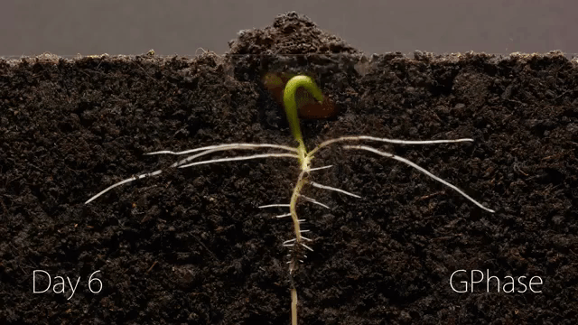
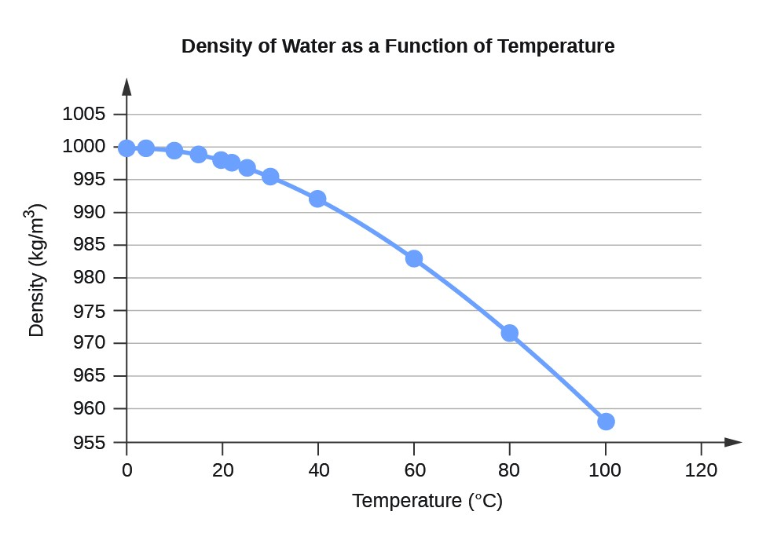
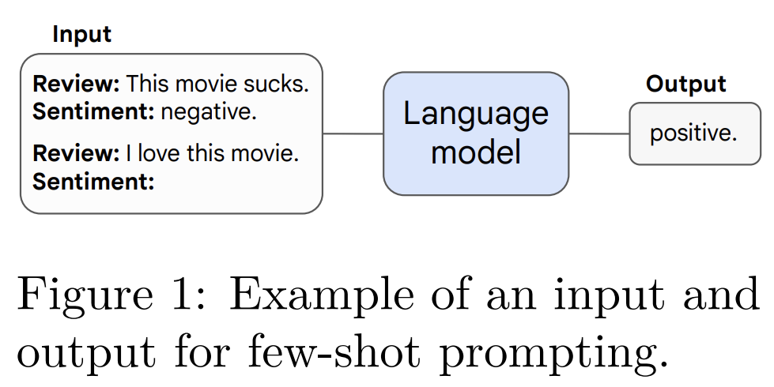
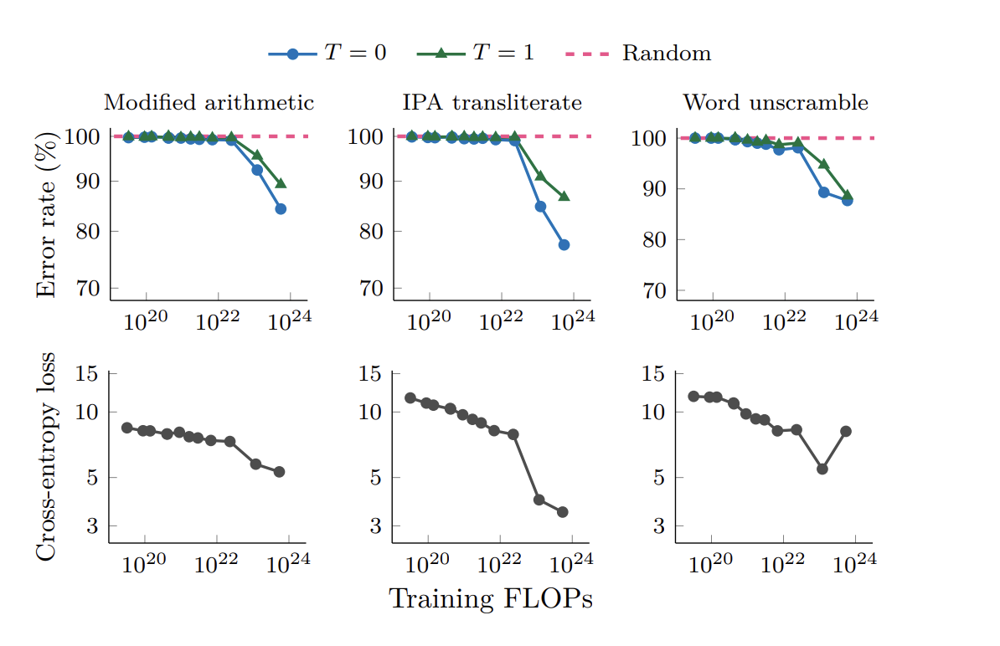
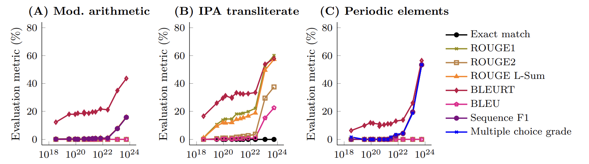
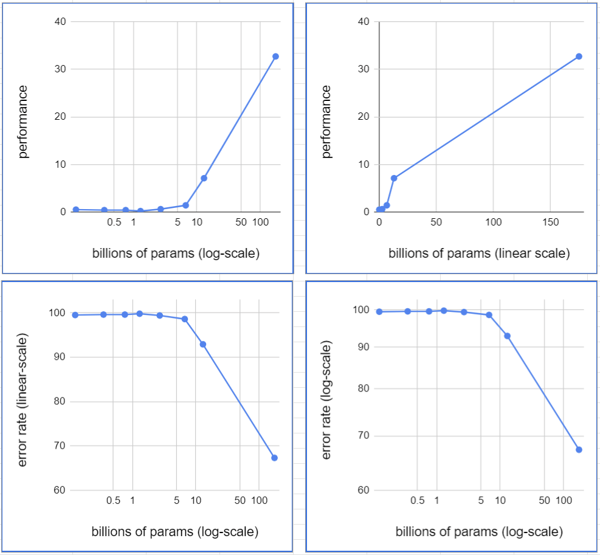

# LLM_Emergence
This repo discusses a 2022 paper primarily out of Google titled "Emergent Abilities of Large Language Models"

# Emergent Abilities of Large Language Models
Transactions on Machine Learning Research 08/2022

Jason Wei, Yi Tay, Rishi Bommasani, Colin Raffel, Barret Zoph, Sebastian Borgeaud, Dani Yogatama , Maarten Bosma, Denny Zhou, Donald Metzler, Ed H. Chi, Tatsunori Hashimoto, Oriol Vinyals, Percy Liang, Jeff Dean, William Fedus

## Outline
- Background and overview of emergence
- Key observations seen among Large Language Models (LLMs)
- Approach for their in-depth look into these observations
- Critiques
- Conclusions

## Overview
**What are _emergent abilities_ as seen in nature?** 
- Emergent abilities can be thought of as *sudden appearances* of a given ability.
- These are typically applied to a *specific application*: for instance, sunlight absorbance
  is an emergent ability of this sprout from near 0 at day 6 to a significant amount on day 7.
  

- Similarly, if you measure water's ability to dissolve other substances or be compressed, these abilities will drastically change
  at 0 celcius and 100 celcius.
  

**In contrast, some properties such as density scale over a given range**

**Many abilities of Large Language Models' scale linearly such as total loss on their test set**

### Which of these LLM abilities do you think are emergent?
- Arithmetic
- Understanding what a word means in context
  
*(Answer given below)*

# Paper's Overall Approach:

- To aggregate LLMs of many scales and assess them for accuracy on widely used and approved benchmarks.

### There are 3 simplistic ways of looking at model scale:
1. Number of Parameters
2. Training Set Size
3. Training FLOPs
- other ways: architecture, training epochs, amount of high quality data, benchmarked performance on one thing

## They argue all 3 are correlated, but #3 is a good metric to encompass the others 

- Emergence in this paper is thus the sudden increase from random accuracy to meaningful accuracy as Training FLOPs increase.
  
## Method 1: Few Shot Prompting

  

- Other specialized prompting techniques were also used and emergence was seen for them as well.
  
***************************** Insert here Wiki stuff if time *************************************
  
## In contrast Cross-Entropy Loss *scales* with training FLOPS

## Interestingly "Partial-Credit" Metrics also exhibit emergence with increased training FLOPs

- "BLEU", "ROUGE", and "BLEURT" are the partial credit
- 

## Critiques:
- I personally am unsure of if FLOPs is the best metric. But they did also look by metrics like # of parameters
- Although out of the scope of this I'd be interested in comparison to emergence for other machine-learning model types
- Using a mix of linear and log axes could skew our perception of the phenomena.
- - But I do think this is the best way to think of these models.
  - These are the same results on a linear scale.
		  - Results for GPT-3 of different parameter sizes:
      

## Final Question:
If we are trying to develop Artificial General Intelligence do you think we need loss functions focused on this goal
or do you think it will simply "emerge"?

## Reference
- Primary paper Jason Wei et al., “Emergent Abilities of Large Language Models” (arXiv, October 26, 2022), http://arxiv.org/abs/2206.07682.
- "Scaling Laws for Neural Language Models" https://arxiv.org/pdf/2001.08361.pdf
- https://laughingsquid.com/kidney-bean-plant-sprouting-timelapse/
- https://makeagif.com/gif/ice-to-boiling-timelapse-HyVX3p
- https://courses.lumenlearning.com/suny-mcc-chemistryformajors-2/chapter/water-properties-2/
- The creation of this repo was assisted by Claude 
