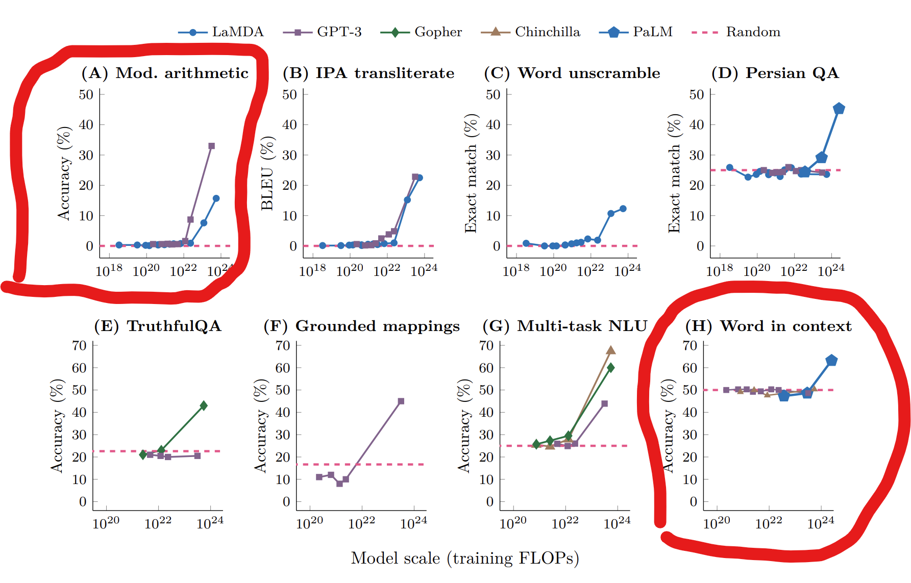

# LLM_Emergence
This repo discusses a 2022 paper primarily out of Google titled "Emergent Abilities of Large Language Models"

# Emergent Abilities of Large Language Models
Transactions on Machine Learning Research 08/2022

Jason Wei, Yi Tay, Rishi Bommasani, Colin Raffel, Barret Zoph, Sebastian Borgeaud, Dani Yogatama , Maarten Bosma, Denny Zhou, Donald Metzler, Ed H. Chi, Tatsunori Hashimoto, Oriol Vinyals, Percy Liang, Jeff Dean, William Fedus

## Outline
- Background and overview of emergence
- Key observations seen among Large Language Models (LLMs)
- Approach for their in-depth look into these observations
- Critiques
- Conclusions

## Overview
**What are _emergent abilities_ as seen in nature?** 
- Emergent abilities can be thought of as *sudden appearances* of a given ability.
- These are typically applied to a *specific application*: for instance, sunlight absorbance
  is an emergent ability of this sprout from near 0 at day 6 to a significant amount on day 7.
  

- Similarly, if you measure water's ability to dissolve other substances or be compressed, these abilities will drastically change
  at 0 celcius and 100 celcius.
  

**In contrast, many abilities of Large Language Models' *scale linearly* such as total loss on their test set**

### Which (or both) of these LLM abilities do you think are emergent?
- Performing Arithmetic
- Word in Context Matching
  

*(Answer given below)*

# Paper's Overall Approach:

- To aggregate LLMs of many scales and assess them for accuracy on widely used and approved benchmarks.

### There are 3 simplistic ways of looking at model scale:
1. Number of Parameters
2. Training Set Size
3. Training FLOPs
- other ways: architecture, training epochs, amount of high quality data, etc.

## They argue all 3 are correlated, but #3 is a good metric to encompass the others 

- Emergence in this paper is thus the sudden increase from random accuracy to meaningful accuracy as Training FLOPs increase.
  
## Method 1: Few Shot Prompting showed emergence

  

## Method 2: Various other specialized prompting techniques also led to emergence *(step-by-step thinking and tool use shown below)*

## In contrast Cross-Entropy Loss *scales* with training FLOPS in some cases
- This indicates the guesses are linearly improving within the model's high-dimensional encoding though this isn't detectable when converted into output tokens and graded as correct or incorrect.
- 

## Even with "Partial-Credit", accuracy emergences instead of scaling
- "BLEU", "ROUGE", and "BLEURT" are all partial credit metrics
- 

## They hypothesize that emergence may also be predictable by comparing to a good proxy instead of model scale

## Formal Pseudocode
LLMEmergenceWhenPlotting
/* Emergent abilities in Large Language Models can be detected when they exhibit this behavior in a plot of Training FLOPs vs Performance */
**Input**: a, b ∈ ℝ, where a is a semi-large number of Training FLOPs and b is a value statistically significantly higher than baseline performance.
**Output**: A plot with Large Language Model Training FLOPs on the X-axis and Performance on the Y-axis.
**Parameters**: 
	n ∈ N , is the number of models (data points).
	X = {x1, ..., xn} ⊆ R, is the Training FLOP values which correspond to the x-axis.
	Y = {y1, ..., yn} ⊆ R, is the model performance which is plotted on the y-axis. Here Baseline performance is represented at 0.
 
For i from 1 to n:
	If xi < a, yi = 0
	If xi = a, yi = b
	If xi > a, yi = xi
 
/* If the performance of an LLM ability can be approximated in this form then it is emergent.

## Conclusions
- Many AI abilities we care about such as ability to perform arithmetic suddenly emerge instead of continually scaling
- The field doesn't currently have a great way of predicting when new abilities will emerge.
- Cross-entropy loss often starts decreasing a while before an emergent ability actually appears, when looking at training FLOPs. This could 
- When predicting if future better-designed models have certain emergent abilities, a more generalized metric than FLOPs, such as WikiText Perplexity, could be a stand-in.

  
## Critiques:
- I personally am unsure of if FLOPs is the best metric. But they did also look by metrics like # of parameters
- Although out of the scope of this I'd be interested in comparison to emergence for other machine-learning model types
- Using a mix of linear and log axes could skew our perception of the phenomena.
- - But I do think this is the best way to think of these models.
  - These are the same results on a linear scale.
		  - Results for GPT-3 of different parameter sizes:
    
- Code to make the following 

## Final Question:
If we are trying to develop Artificial General Intelligence do you think we need loss functions focused on this goal
or do you think it will simply "emerge"?

## README References
- Primary paper Jason Wei et al., “Emergent Abilities of Large Language Models” (arXiv, October 26, 2022), http://arxiv.org/abs/2206.07682.
- "Scaling Laws for Neural Language Models" https://arxiv.org/pdf/2001.08361.pdf
- https://laughingsquid.com/kidney-bean-plant-sprouting-timelapse/
- https://makeagif.com/gif/ice-to-boiling-timelapse-HyVX3p
- https://courses.lumenlearning.com/suny-mcc-chemistryformajors-2/chapter/water-properties-2/
- The creation of this repo was assisted by Claude

## Paper Data Links:
- https://paperswithcode.com/dataset/wikitext-2
- https://paperswithcode.com/dataset/truthfulqa
- https://paperswithcode.com/dataset/wikitext-103
- https://paperswithcode.com/dataset/mmlu
- https://paperswithcode.com/dataset/wic
